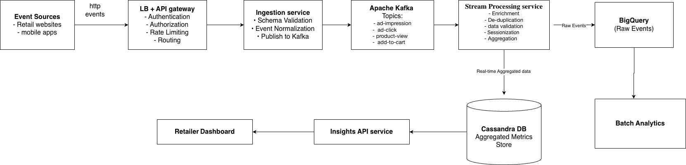
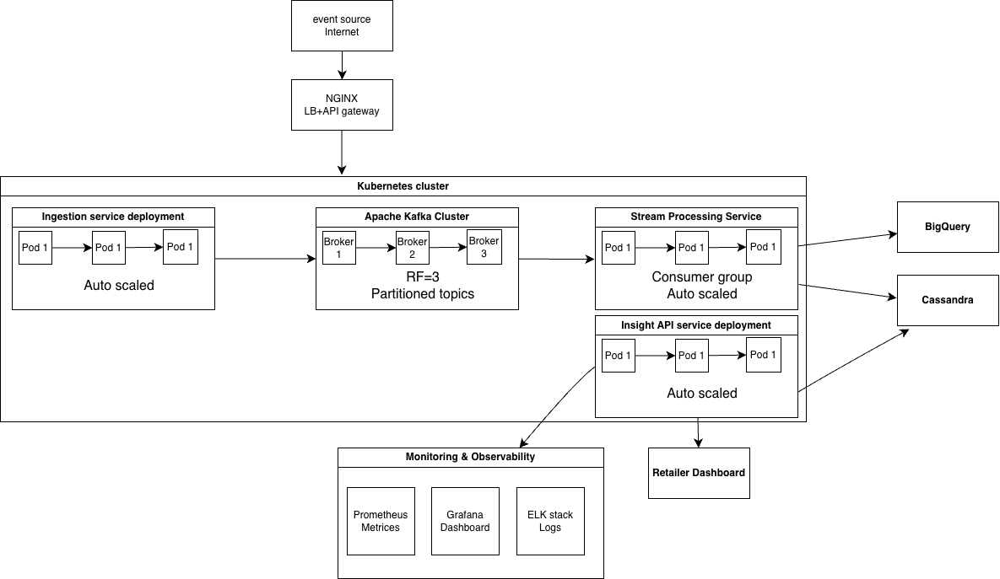

# Campaign Insights API

The service supports both real-time and historical queries, demonstrates multi-tenancy, implements retry handling for transient failures, and uses a containerized Apache Cassandra instance as the real-time data store.

---

# Technology Choices

| Layer               | Technology                                  | Why Chosen                                                                                 |
|---------------------|---------------------------------------------|--------------------------------------------------------------------------------------------|
| API Gateway         | Kong / AWS API Gateway                      | Authentication, authorization, rate limiting, and request routing                          |
| Load Balancer       | AWS ALB / HAProxy                           | Distributes incoming traffic across multiple service instances                             |
| Backend Services    | Java 21, Spring Boot                        | Mature ecosystem, high performance, excellent support for microservices                    |
| Event Streaming     | Apache Kafka                                | High-throughput, low-latency, durable event streaming with partitioning                    |
| Stream Processing   | Spring Boot Kafka Consumers                 | Real-time validation, enrichment, deduplication, sessionization, and aggregation           |
| Real-time Database  | Apache Cassandra                            | Horizontally scalable, write-optimized, low-latency reads for real-time aggregated metrics |
| Analytics Warehouse | BigQuery                                    | Large-scale analytical queries and historical reporting                                    |
| REST APIs           | Spring Boot REST                            | Exposes Insights APIs to dashboards and external clients                                   |
| Containerization    | Docker                                      | Consistent packaging and deployment across environments                                    |
| Orchestration       | Kubernetes                                  | Auto-scaling, self-healing, and rolling deployments                                        |
| Monitoring          | Prometheus + Grafana                        | Metrics collection, dashboards, and alerting                                               |
| Logging             | ELK Stack (Elasticsearch, Logstash, Kibana) | Centralized logging, search, and troubleshooting                                           |
| CI/CD               | GitHub Actions / Jenkins                    | Automated build, test, and deployment                                                      |
| Source Control      | GitHub                                      | Version control and code collaboration                                                     |

---

# Architecture

## Solution Architecture



## Deployment Overview



---

# Features

- Real-time campaign insights
- Historical campaign insights
- Multi-tenant support
- Retry for transient Cassandra failures
- Global exception handling
- Swagger API documentation
- Dockerized Cassandra setup

---

# Project Structure

```
src
├── controller
├── service
│   └── impl
├── repository
├── entity
├── model
├── exception
├── constant
├── config
└── resources
    └── historical-data.json

docker/
└── cassandra/
    ├── schema.cql
    ├── data.cql
    └── init.sh

docker-compose.yml
README.md
```

---

# Prerequisites

- Java 21
- Maven
- Docker Desktop

---

# Running the Project
### Clone the repository

```bash
git clone https://github.com/meeta525/insights-api-service.git
cd insights-api-service
```
### Start Cassandra

```bash
docker compose up -d
```

### Run Spring Boot

```bash
./mvnw spring-boot:run
```

or run `InsightsApiApplication` from IntelliJ.

---

# Swagger UI

After the application starts, open:

```text
http://localhost:8080/swagger-ui/index.html
```

---

# Demo APIs

### Realtime

Header

```http
X-Tenant-Id: amazon
```

Request

```http
GET /ad/CAMP1001/clicks
```

---

## Historical

Header

```http
X-Tenant-Id: amazon
```

Request

```http
GET /ad/CAMP1001/clicks?from=2026-07-01&to=2026-07-07
```

---

# Sample Demo Data

| Tenant | Campaign |
|---------|----------|
| amazon | CAMP1001 |
| amazon | CAMP1002 |
| flipkart | CAMP1001 |
| flipkart | CAMP1002 |

---

# Retry Demo
This demonstrates retry handling when the real-time Cassandra datastore is temporarily unavailable.
### Stop Cassandra

```bash
docker stop cassandra
```

Invoke

```
GET /ad/CAMP1001/clicks
```

The application retries three times before returning

```
HTTP 503 Service Unavailable
```

Restart Cassandra

```bash
docker start cassandra
```

---

# Design Decisions

## Why Cassandra?

- High write throughput
- Horizontal scalability
- Low-latency reads
- Well suited for real-time campaign metrics

## Why separate Realtime and Historical services?

Keeps responsibilities isolated.

- Realtime service reads live metrics from Cassandra.
- Historical service reads aggregated analytics from a JSON file (BigQuery in production).

## Why JSON?

The assignment focuses on service design rather than cloud integration.

The JSON file simulates historical data, allowing the project to run locally without requiring a cloud dependency. In production, this service would query BigQuery.

## Why Multi-tenancy?

Each request contains an `X-Tenant-Id` header to isolate retailer data.

---

# Future Improvements

- Replace JSON with BigQuery
- Add Circuit Breaker
- Kubernetes deployment

---

# Author

Meeta Srivastava